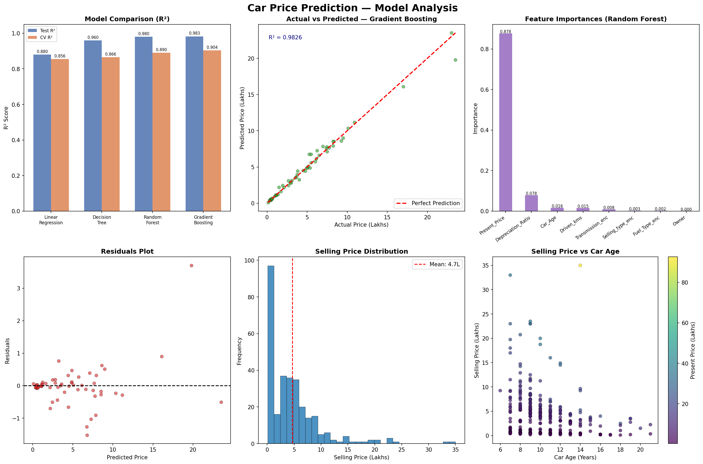
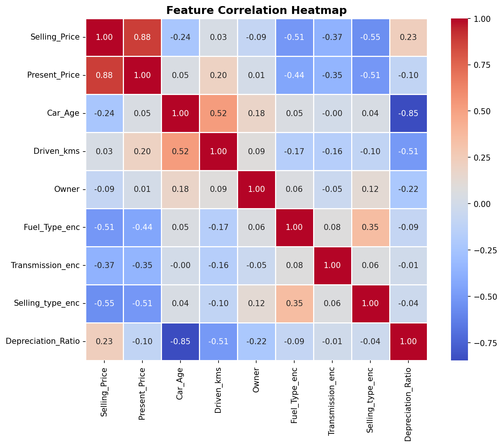

# 🚗 Car Price Prediction with Machine Learning

**CodeAlpha Data Science Internship — Task 3**

## Overview
This project builds and evaluates multiple machine learning regression models to predict the **selling price of used cars** based on features like present price, car age, mileage, fuel type, transmission, and ownership history.

## Project Structure
```
car_price_prediction/
├── data/
│   └── car_data.csv                  # Dataset (301 records)
├── outputs/
│   ├── fig1_car_price.png            # Main analysis dashboard
│   └── fig2_correlation.png          # Feature correlation heatmap
├── car_price_prediction.py           # Main prediction script
├── requirements.txt
└── README.md
```

## Dataset
- **Records:** 301 used cars
- **Features:** Car_Name, Year, Present_Price, Driven_kms, Fuel_Type, Selling_type, Transmission, Owner
- **Target:** Selling_Price (in Lakhs ₹)
- **Price Range:** ₹0.1L – ₹35L

## Feature Engineering
| New Feature | Description |
|---|---|
| `Car_Age` | 2024 - Year of manufacture |
| `Price_Depreciation` | Present_Price - Selling_Price |
| `Depreciation_Ratio` | Selling_Price / Present_Price |
| Encoded categoricals | Fuel_Type, Selling_type, Transmission → numeric |

## Model Results

| Model | MAE (₹L) | RMSE (₹L) | R² | CV R² |
|---|---|---|---|---|
| Linear Regression | 1.07 | 1.66 | 0.8800 | 0.8556 |
| Decision Tree | 0.51 | 0.96 | 0.9601 | 0.8658 |
| Random Forest | 0.38 | 0.68 | 0.9802 | 0.8905 |
| **Gradient Boosting** | **0.32** | **0.63** | **0.9826** | **0.9039** |

✅ **Best Model: Gradient Boosting — R² = 0.9826 (98.26% variance explained)**

## Feature Importances (Random Forest)
| Feature | Importance |
|---|---|
| Present_Price | 87.8% |
| Depreciation_Ratio | 7.8% |
| Car_Age | 1.6% |
| Driven_kms | 1.5% |
| Transmission | 0.8% |

## Key Insights
1. **Present Price** is the strongest predictor — dominates at 87.8% importance
2. **Gradient Boosting** achieved the best R² of **98.26%** with MAE of only ₹0.32L
3. **Car Age** and **Driven_kms** negatively impact resale value
4. **Automatic transmission** cars command higher resale prices
5. **Dealer sales** consistently yield higher prices than individual sellers
6. Most used cars are priced under ₹10L, with a right-skewed distribution

## Visualizations

### Figure 1 — Main Analysis Dashboard


### Figure 2 — Feature Correlation Heatmap


## How to Run
```bash
cd codealpha_tasks/car_price_prediction
pip install -r requirements.txt
python car_price_prediction.py
```

## Technologies Used
- Python 3.x
- Scikit-learn (LinearRegression, DecisionTree, RandomForest, GradientBoosting)
- Pandas & NumPy
- Matplotlib & Seaborn

---
*Author: Gemechu Ejeta Atomsa | CodeAlpha Data Science Internship*
