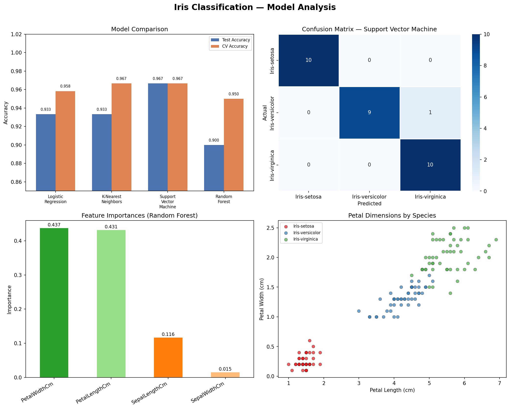

# 🌸 Iris Flower Species Classification

**CodeAlpha Data Science Internship — Task 1**

## Overview
This project trains and evaluates multiple machine learning classifiers to predict the species of Iris flowers (**Setosa**, **Versicolor**, **Virginica**) based on sepal and petal measurements.

## Project Structure
```
iris_classification/
├── data/
│   └── Iris.csv              # Dataset (150 samples, 4 features)
├── outputs/
│   └── iris_classification.png  # Visualization plots
├── iris_classification.py    # Main classification script
├── requirements.txt          # Python dependencies
└── README.md
```

## Dataset
- **Source:** UCI Machine Learning Repository / Kaggle
- **Samples:** 150 (50 per class)
- **Features:** SepalLengthCm, SepalWidthCm, PetalLengthCm, PetalWidthCm
- **Target:** Species (Iris-setosa, Iris-versicolor, Iris-virginica)

## Models Trained
| Model | Test Accuracy | CV Accuracy (5-fold) |
|---|---|---|
| Logistic Regression | 93.3% | 95.8% |
| K-Nearest Neighbors | 93.3% | 96.7% |
| **Support Vector Machine** | **96.7%** | **96.7%** |
| Random Forest | 90.0% | 95.0% |

✅ **Best Model: Support Vector Machine (RBF kernel) — 96.7% accuracy**

## Key Findings
- **Petal Length** and **Petal Width** are the most important features
- **Iris-setosa** is perfectly separable (100% precision & recall)
- **Versicolor** and **Virginica** slightly overlap — source of the 1 misclassification
- SVM with RBF kernel handles this non-linear boundary best

## How to Run
```bash
# 1. Clone the repo
git clone https://github.com/<your-username>/codealpha_tasks.git
cd codealpha_tasks/iris_classification

# 2. Install dependencies
pip install -r requirements.txt

# 3. Run the script
python iris_classification.py
```

## Visualizations
The script generates a 4-panel figure saved to `outputs/`:
- Model comparison (Test vs CV accuracy)
- Confusion matrix for the best model
- Feature importances (Random Forest)
- Petal scatter plot coloured by species



## Technologies Used
- Python 3.x
- Scikit-learn
- Pandas & NumPy
- Matplotlib & Seaborn

---
*Author: Gemechu Ejeta Atomsa | CodeAlpha Data Science Internship*
