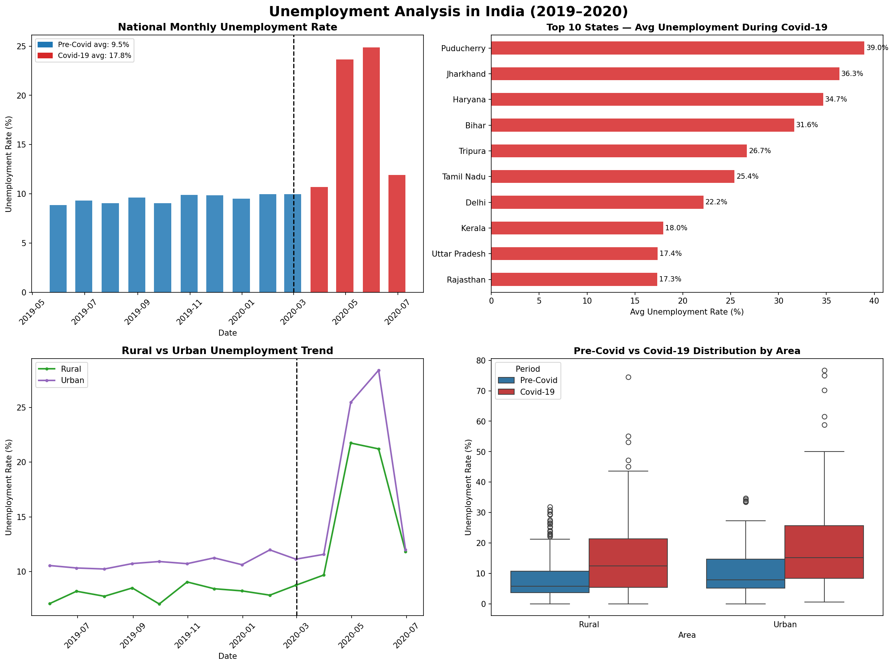
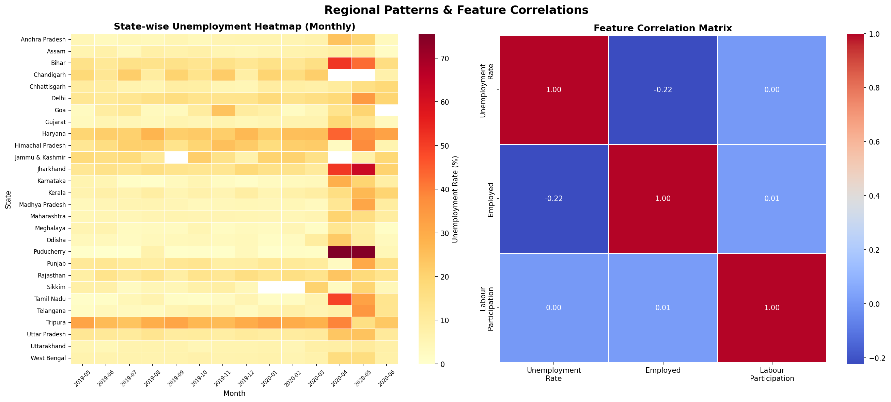

# 📉 Unemployment Analysis with Python

**CodeAlpha Data Science Internship — Task 2**

## Overview
This project analyzes unemployment data across 28 Indian states from May 2019 to June 2020, with a focus on investigating the impact of **Covid-19 lockdowns** on unemployment rates, identifying regional and rural/urban patterns, and drawing policy-relevant insights.

## Project Structure
```
unemployment_analysis/
├── data/
│   └── Unemployment_in_India.csv     # Source dataset (740 records)
├── outputs/
│   ├── fig1_trend_covid.png          # National trend & Covid impact
│   └── fig2_regional_corr.png        # Regional heatmap & correlations
├── unemployment_analysis.py          # Main analysis script
├── requirements.txt
└── README.md
```

## Dataset
- **Source:** CMIE (Centre for Monitoring Indian Economy) via Kaggle
- **Records:** 740 (after cleaning)
- **Period:** May 2019 – June 2020
- **Features:** Region, Date, Unemployment Rate (%), Employed, Labour Participation Rate (%), Area (Rural/Urban)
- **States:** 28

## Key Findings

### Covid-19 Impact
| Period | Avg Unemployment Rate |
|---|---|
| Pre-Covid (May 2019 – Feb 2020) | 9.51% |
| Covid-19 (Mar 2020 – Jun 2020) | 17.77% |
| **Increase** | **+8.26 percentage points** |

- **Peak:** Puducherry hit **76.74%** unemployment in April 2020
- Covid-19 nearly **doubled** the national unemployment rate

### Regional Patterns
- **Worst-hit states during Covid:** Puducherry, Jharkhand, Bihar, Tamil Nadu, Delhi
- States with strong informal/agriculture sectors recovered faster

### Rural vs Urban
- Urban areas experienced **sharper spikes** during lockdowns
- Rural employment remained more stable due to agriculture and MGNREGA scheme

### Feature Correlations
- Unemployment Rate is **negatively correlated** with Labour Participation Rate — many workers left the workforce entirely during Covid (discouraged worker effect)
- Employment count dropped sharply in April–May 2020

## Policy Insights
1. **Targeted urban relief** is critical during pandemic-induced lockdowns
2. **MGNREGA expansion** in rural areas helped cushion unemployment shocks
3. States with high informal employment (Bihar, Jharkhand) need stronger social safety nets
4. **Labour participation collapse** signals hidden unemployment beyond official rates
5. Regional disparity demands state-specific rather than uniform national policies

## Visualizations

### Figure 1 — National Trend & Covid Impact


### Figure 2 — Regional Heatmap & Correlations


## How to Run
```bash
cd codealpha_tasks/unemployment_analysis
pip install -r requirements.txt
python unemployment_analysis.py
```

## Technologies Used
- Python 3.x
- Pandas & NumPy
- Matplotlib & Seaborn

---
*Author: Gemechu Ejeta Atomsa | CodeAlpha Data Science Internship*
